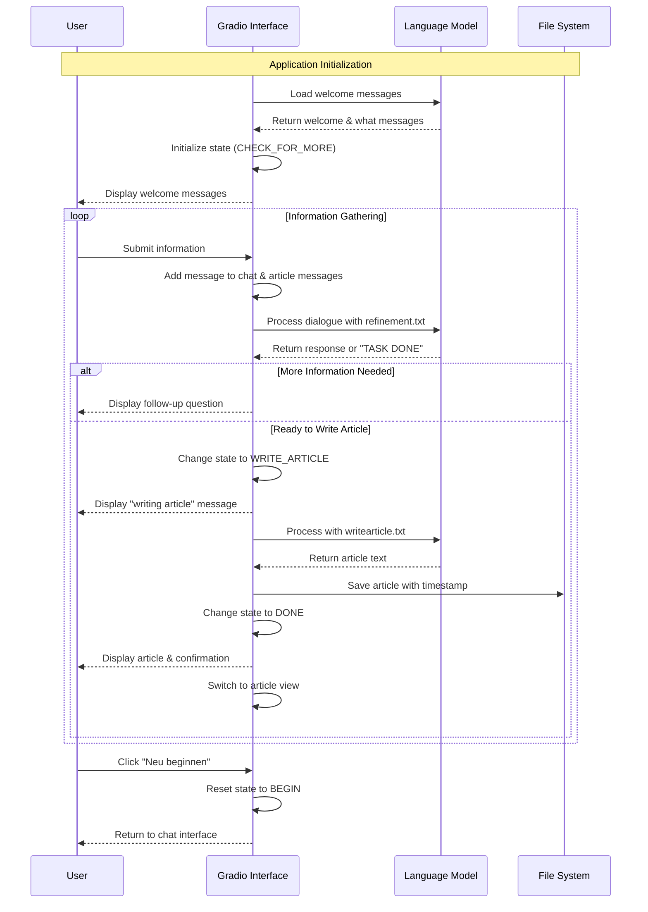
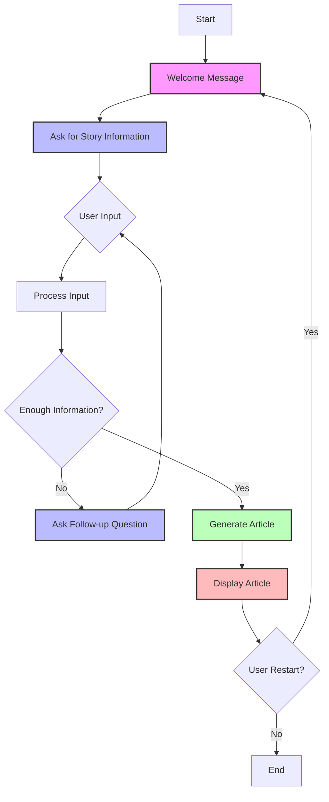

# Heilbronner Stimme Content Submission Bot

This project combines the AI expertise of Dr. Tristan Behrens with the journalistic vision of Robert Mucha. In collaboration with [42 Heilbronn](https://www.42heilbronn.de/en/) and [Heilbronner Stimme](https://www.stimme.de), we have developed an open-source tool to support reader-reporters and strengthen local journalism through AI-driven technologies.

## Purpose

The tool encourages readers to actively contribute stories, enriching local reporting. It leverages advanced AI technologies to streamline content management and enhance interaction between readers and editorial teams.

## Features

- **AI-Powered Support:** Automated processes to assist reader-reporters.  
- **Open Source:** Fully open-source and free to use.  
- **Community-Oriented:** Promotes local journalism and fosters stronger reader engagement.

## Workflow



## User-Assistant Dialogue Flow



## Supported by

This project was made possible through the collaboration with [42 Heilbronn](https://www.42heilbronn.de/en/) and [Heilbronner Stimme](https://www.stimme.de).

## Learn More

- [GitHub Repository](https://github.com/AI-Guru/stimme_contentsubmissionbot)  
- [Tristan's Website](https://ai-guru.de)  
- [Robert on LinkedIn](https://www.linkedin.com/in/robert-mucha-4b323b99/)

## Installation

```
conda create -n stimme python=3.10.13
conda activate stimme
pip install -r requirements.txt
```

Note: You might want to replace the Python version.

Install Ollama: https://ollama.com/

Pull the model:

```
ollama pull gemma2:27b
```

## Start

```
gradio run.py
```

## Access

```
http://0.0.0.0:8001/?__theme=light
```

## Docker

Build the container:

```
docker build -t stimme_contentsubmissionbot .
```

Run it:

```
docker run --rm -it -p 8001:8001 -v $(pwd)/articles:/app/articles stimme_contentsubmissionbot
```

## Docker Compose

You can also run the application with Docker Compose, which will set up both the content submission bot and the Ollama model server:

```bash
# Start the services
docker compose up -d

# View logs
docker compose logs -f

# Stop the services
docker compose down
```

By default, the application will use the `gemma3:27b` model. You can specify a different model by setting the MODEL environment variable:

```bash
MODEL=gemma2:27b docker compose up -d
```

### Docker Compose Features:

- **Automatic Model Serving**: Includes and configures the Ollama service for model inference
- **Volume Mounting**: Persists articles and Ollama models between container restarts
- **Health Checks**: Monitors application health with built-in health checks
- **GPU Support**: Configured to use NVIDIA GPU if available
- **Network Isolation**: Services communicate over an isolated network

The application will be available at http://localhost:8001 after startup.
